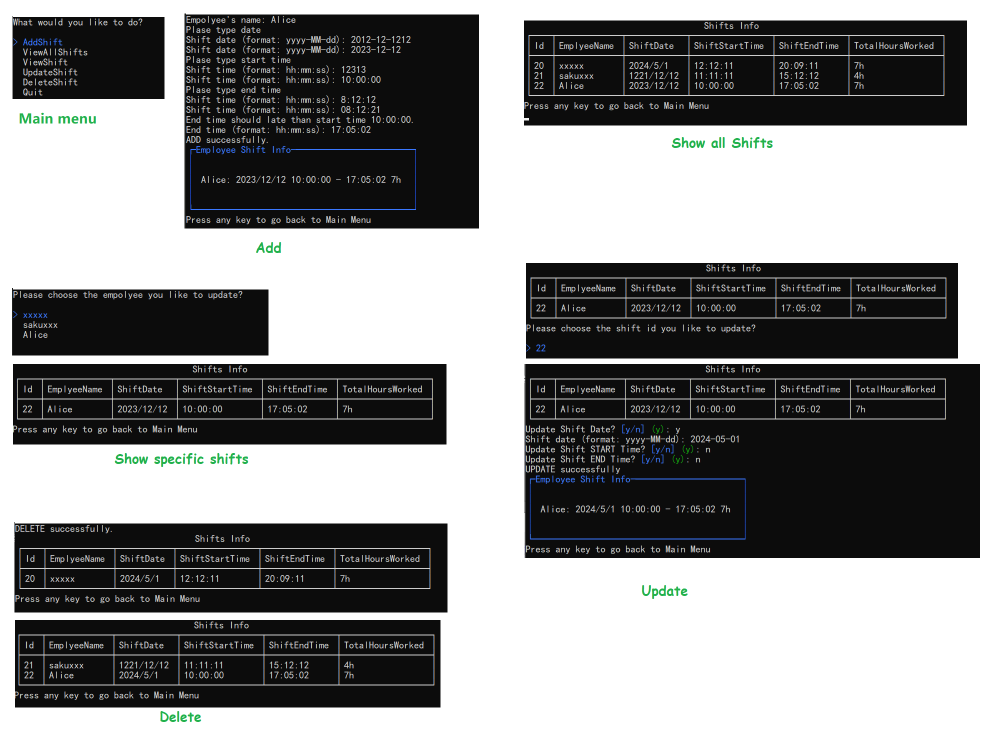

# Shift Logger Web API and Console Application

The Shift Logger application consists of a Web API application and a Console UI application.

The Web API application is created using ASP.NET Core. It also utilizes Entity Framework and SQL LocalDB.

The Console UI application utilizes the basic HTTP request and response methods of C#.

## Web API

This project provides four different kinds of web APIs to users for CRUD operations on employee shifts

### Get

Here this program provides two GET requests web api to fetch all shifts or the shfits of the specific empolyee.

Request URL:`https://localhost:7256/shiftlogger` or `https://localhost:7256/shiftlogger/name/sar`

Response body:

```json
[
    {
        "id": 1,
        "employeeName": "sar",
        "shiftDate": "2024-05-05T00:00:00",
        "shiftStartTime": "12:12:12",
        "shiftEndTime": "22:10:10",
        "totalHoursWorked": 9.966111111111111
    }
]
```

### Post

Request URL: `https://localhost:7256/shiftlogger`

Request Body:

```json
{
    "employeeName": "sakuxxx",
    "shiftDate": "1221-12-12T00:00:00",
    "shiftStartTime": "11:11:11",
    "shiftEndTime": "15:12:12"
}
```

Response Body:

```json
{
    "id": 2,
    "employeeName": "sakuxxx",
    "shiftDate": "1221-12-12T00:00:00",
    "shiftStartTime": "11:11:11",
    "shiftEndTime": "15:12:12",
    "totalHoursWorked": 4.016944444444444
}
```

### Put

Request URL: `https://localhost:7256/shiftlogger/19`

Request Body:

```json
{
    "Id": 19,
    "EmployeeName": "xxx",
    "ShiftDate": "2024-12-22T00:00:00",
    "ShiftStartTime": "11:11:11",
    "ShiftEndTime": "15:12:12"
}
```

Response Body:

```json
{
    "id": 19,
    "employeeName": "xxx",
    "shiftDate": "2024-12-22T00:00:00",
    "shiftStartTime": "11:11:11",
    "shiftEndTime": "15:12:12",
    "totalHoursWorked": 4.016944444444444
}
```

### Delete

Here this program provides the delete web api to delete the shifts of the sepecific empolyee.

Request URL: `https://localhost:7256/shiftlogger/xxx`

Response Body:

```json
[
    {
        "id": 19,
        "employeeName": "xxx",
        "shiftDate": "2024-12-22T00:00:00",
        "shiftStartTime": "11:11:11",
        "shiftEndTime": "15:12:12",
        "totalHoursWorked": 4.016944444444444
    }
]
```

## Console Application

This console application provides a menu for users to manipulate employee shifts.

Here are some screenshots.



## Reference

* <https://thecsharpacademy.com/project/17/shifts-logger>

* [Back-end Web Development with .NET for Beginners](https://learn.microsoft.com/en-us/shows/back-end-web-development-with-dotnet-for-beginners/)

* [Tutorial: Create a web API with ASP.NET Core](https://learn.microsoft.com/en-us/aspnet/core/tutorials/first-web-api?view=aspnetcore-6.0&tabs=visual-studio)

* Stack Overflow
