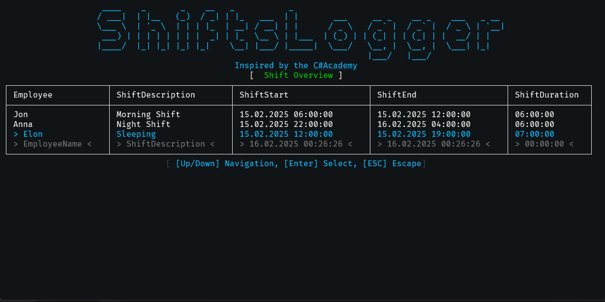

# Shifts Logger App

The **Shifts Logger App** is an interactive console and API-based application
designed to help manage and track employee shifts efficiently.

Inspired by the [C# Academy Shifts Logger Project](https://thecsharpacademy.com/project/17/shifts-logger).

## 📸 Overview



## How It Works

1. **Launch the App.**
2. **Navigate the Menu** using arrow keys.
3. **View Shifts:** See an overview of all shifts.
4. **Manage Shifts:** Add, edit, or remove shifts.
5. **Exit the App** using the provided menu option.


## Technologies Used

- **Scalar.AspNetCore** - Swagger API.
- **Entity Framework Core** - ORM for database interactions.
- **Spectre.Console** - Interactive console UI.


## Getting Started

1. **Run the API Backend:**

   ```sh
   dotnet run --project ShiftsLogger.Backend
   ```

2. **Run the Console App:**

   ```sh
   dotnet run --project ShiftsLogger.App
   ```
