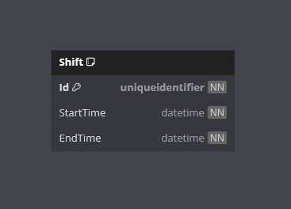

# Shifts Logger

Welcome to the Shifts Logger App!

This is a .NET project to demonstrate creating
and consuming Web APIs alongside Entity Framework.

## Requirements

- [x] Application must be able to record a worker's shifts.
- [x] Must have both a Web API and UI application.
- [x] Database interaction must be via Entity Framework.
- [x] The database provider must be SQL Server.
- [x] No raw SQL.
- [x] The Code-First approach must be taken with Entity Framework.
- [x] User input validation must happen in the UI applicaiton.
- [x] UI application must have try-catch blocks around the API calls.

## Features

- **Shifts**

    View a list of shifts. Log a new shift, update or delete an existing shift.

- **Database Seeding**

    Set `SeedDatabase` to `true` in the web api projects appsettings.json file
if you wish to generate mocked up seed data on initial database creation.

## Getting Started

**IMPORTANT!**

I have already created and staged the InitialCreate database migration in the
repo.

Entity Framework will handle the database creation for you.

The web api application will handle the performing of any created database
migrations.

The web api application should be started up before the console application.

### Prerequisites

- .NET 8 SDK installed on your system.
- A code editor like Visual Studio or Visual Studio Code
- SQL Server
- SQL Server Management Studio (SSMS)

### Installation

1. Clone the repository:
    - `git clone https://github.com/cjc-sweatbox/shifts-logger.git`

2. Configure the application:
    - Navigate to the `.\src\ShiftsLogger.Api\` directory.
    - Update the `appsettings.json` file with your database connection string.

3. Build the application:
    - Navigate to the `.\src\` directory.
    - `dotnet build`

### Running the Application

1. First, run the web api application using the .NET CLI:
    - Navigate to the `.\src\ShiftsLogger.Api\` directory.
    - `dotnet run`

2. Then, run the console application using the .NET CLI:
    - Navigate to the `.\src\ShiftsLogger.ConsoleApp\` directory.
    - `dotnet run`

### Usage

- **Database Migrations**:
On initial startup, any outstanding database migrations will be performed.
- **Database Seeding**:
On initial startup and if configured to, the database will be seeded with mock
data.
- **Main Menu**:
Select an option to perform.
- **View Shift**:
Displays all your shifts.
- **Log a Shift**:
Record the start and end times for a shift to add to the database.
- **Update Shift**:
Select a shift to update, and record the updated shift details to update in the
database.
- **Delete Shift**:
Select a shift to delete from the database.
- **Close Application**:
Closes the application.

## How It Works

- **Console Application**:
Display and navigation is aided by the
[Spectre Console](https://spectreconsole.net/) library.
- **Data Storage**:
An SQL Server database is used to store the application data.
- **Data Access**:
Code-First Entity Framework is used for the database access methods.
- **Data Seeding**:
If configured, a set of mock shifts will be added to the database.
- **Report Display**:
Uses the Tables class provided by the
[Spectre Console](https://spectreconsole.net/) library to display structured
and formatted tables.

## Database

---
***Happy Shiftslogging!***
