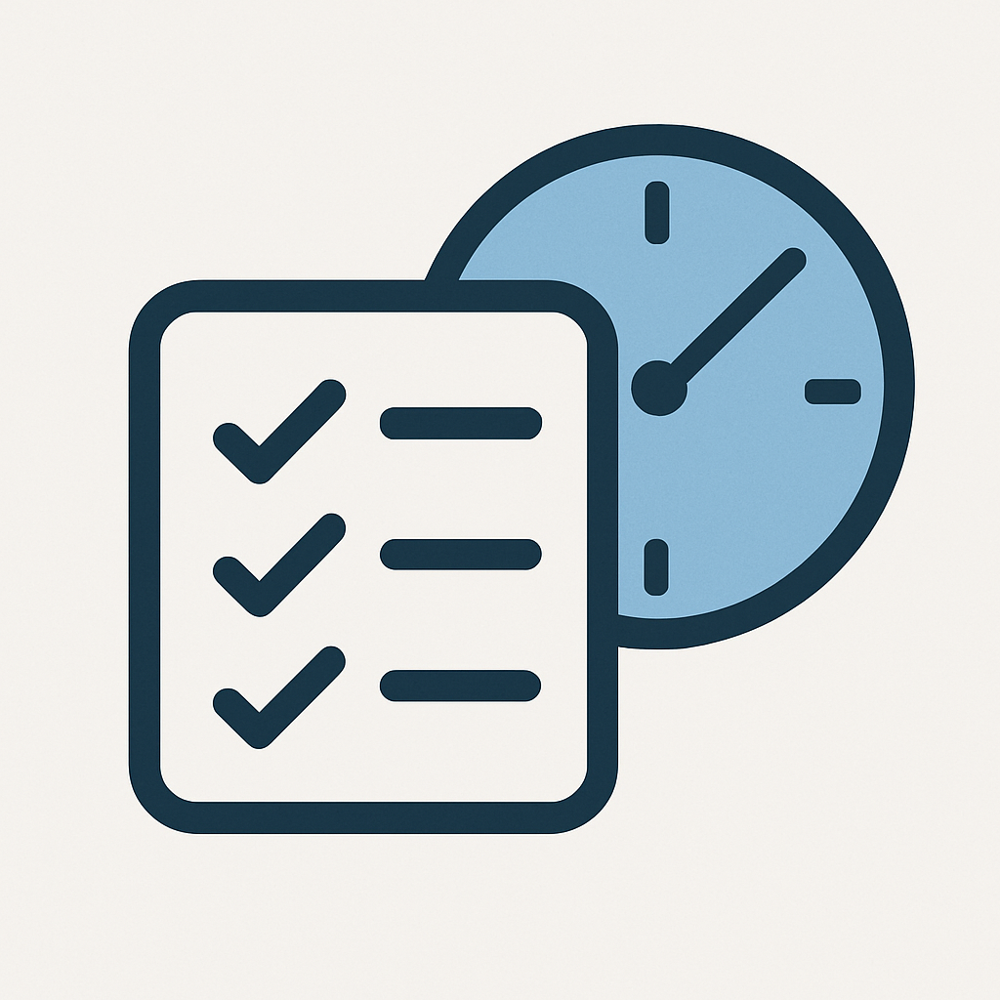
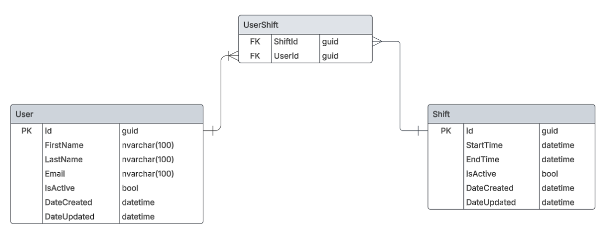

[](https://sonarcloud.io/summary/new_code?id=nwdorian_ShiftsLogger)
[](https://sonarcloud.io/summary/new_code?id=nwdorian_ShiftsLogger)
[](https://sonarcloud.io/summary/new_code?id=nwdorian_ShiftsLogger)
[](https://sonarcloud.io/summary/new_code?id=nwdorian_ShiftsLogger)
[](https://sonarcloud.io/summary/new_code?id=nwdorian_ShiftsLogger)

<div align="center">
    
    <h1>Shifts Logger</h1>
</div>

This is a .NET application for tracking employee working hours. It allows users to assign and track workers shifts.

The backend is a .NET Web API that provides endpoints for managing database records. Frontend is a .NET Console Application for user interaction.

Documentation also available on [Github Pages](https://nwdorian.github.io/ShiftsLogger/index.html)

## Table of Contents

- [Features](#features)
- [Technologies](#technologies)
- [Getting Started](#getting-started)
  - [Prerequisites](#prerequisites)
  - [Installation](#installation)
  - [Running the application](#running-the-application)
- [Database Schema](#database-schema)
- [WebApi Project Structure](#webapi-project-structure)
  - [Multi-Layer Architecture](#multi-layer-architecture)
  - [Dependency Injection](#dependency-injection)
  - [Model types](#model-types)
- [Code Quality Analysis](#code-quality-analysis)
  - [Github Actions Workflow](#github-actions-workflow)
- [REST API documentation](#rest-api-documentation)
  - [How to integrate DocFx with Github Pages](#how-to-integrate-docfx-with-github-pages)
    - [1. Install Tools and Packages](#1-install-tools-and-packages)
    - [2. Setup .csproj](#2-setup-csproj)
    - [3. Initialise DocFx](#3-initialise-docfx)
    - [4. Add REST API section to DocFx](#4-add-rest-api-section-to-docfx)
    - [5. Enable Github pages](#5-enable-github-pages)
    - [6. Add workflow file](#6-add-workflow-file)
- [Contributing](#contributing)
- [License](#license)
- [Contact](#contact)

## Features

- **User management**: Create, delete and edit employee information.
- **Shifts management**: Create, delete and edit shifts. Assign or remove workers from shifts and preview working hours.
- **Data seeding**: Provides the option to add fake data for demonstration.

## Technologies

- **.NET 9**: The latest .NET version.
- **Entity Framework Core**: Database management and ORM.
- **SQL Server**: Main database system.
- **Automapper**
- **Refit**
- **xUnit**: Unit and integration tests.

## Getting Started

> [!NOTE]
> The `InitialCreate` migration was created.
>
> It will be applied on startup of the API application and create the database and tables.

### Prerequisites

- .NET 9 SDK
- A code editor like Visual Studio or Visual Studio Code
- SQL Server
- SQL Server Management Studio (optional)

### Installation

1. Clone the repository
   - `https://github.com/nwdorian/ShiftsLogger.git`
2. Configure the appsettings.json
   - Update the connection string
3. Navigate to the API project folder
   - `cd .\WebApi`
4. Build the Web API application using .NET CLI
   - `dotnet build`
5. Navigate to the Console project folder
   - `cd .\ConsoleUI`
6. Build the Console application using the .NET CLI
   - `dotnet build`

### Running the application

1. Run the API application from the API project folder using the .NET CLI
    - `cd .\WebApi\ShiftsLogger.WebApi`
    - `dotnet run`
2. Run the Console application from the Console project folder using the .NET CLI
    - `cd .\ConsoleUI\ShiftsLogger.ConsoleUI`
    - `dotnet run`

## Database Schema



## WebApi Project Structure

### Multi-Layer Architecture

- **Data Access Layer**
  - *ShiftsLogger.DAL*
  - Contains DbContext, entity models, migrations and EF Core configuration files
  - EF Core Configuration
    - Fluent API allows configuration to be specified without modifying entity classes
    - Configurations are extracted to a separate class and loaded with assembly scanning

- **Repository Layer**
  - *ShiftsLogger.Repository* project contains classes for database communication
  - *ShiftsLogger.Repository.Common* project contains interfaces used by dependency injection
  - References *ShiftsLogger.DAL* for obtaining database interaction methods
  - References *ShiftsLogger.Repository.Common* for interface implementation

- **Service Layer**
  - *ShiftsLogger.Service* project has classes which contain business logic
  - *ShiftsLogger.Service.Common* project contains interfaces used by dependency injection
  - References *ShiftsLogger.Service.Common* for interface implementation
  - References *ShiftsLogger.Repository.Common* for dependency injection

- **WebApi Layer**
  - *ShiftsLogger.WebApi* contains REST models and controller classes which handle HTTP requests and responses
  - References *ShiftsLogger.Service.Common* for dependency injection

- **Models Layer**
  - *ShiftsLogger.Models* defines models used in the application
  - Can be referenced by any projects that use the models

- **Common Layer**
  - *ShiftsLogger.Common* contains generic and extension methods, validation, constants, etc.
  - Can be referenced by any project

### Dependency Injection

- Autofac modules are used for registering layer components
- Data Access, Repository and Service layer each contain a module where classes are registered to the Autofac IoC container through their interfaces
- *ShiftsLogger.Root* project acts as a thin layer that composes modules. It serves as the composition root, handling the registration of all modules without exposing the implementation details to the WebApi project.

### Model types

- **Entity models**
  - located in DAL project
  - represent database tables
  - used for database configuration and interaction
- **DTOs**
  - located in Models project
  - models used inside services for business logic
- **REST models**
  - located in WebApi project
  - format the data exposed to clients that consume the API
  - allow modification of internal model types without impacting API consumers

## Code Quality Analysis

- Code quality analysis is done through [SonarQube Cloud](https://sonarcloud.io/)
- It analyses the codebase for best practices along with reliability, security and maintainability issues
- Paired with coverlet.collector NuGet package we get a Test Coverage percentage which has to be >80%

### Github Actions Workflow

- Code analysis runs after push to develop branch as a github action
- Example workflow file *build.yml*

```yml
name: SonarQube Cloud
on:
  push:
    branches:
      - develop
  pull_request:
    types: [opened, synchronize, reopened]
jobs:
  build:
    name: Build and analyze
    runs-on: windows-latest
    environment: Shifts Logger
    steps:
      - name: Set up JDK 17
        uses: actions/setup-java@v4
        with:
          java-version: 17
          distribution: 'zulu' # Alternative distribution options are available.
      - uses: actions/checkout@v4
        with:
          fetch-depth: 0  # Shallow clones should be disabled for a better relevancy of analysis
      - name: Cache SonarQube Cloud packages
        uses: actions/cache@v4
        with:
          path: ~\sonar\cache
          key: ${{ runner.os }}-sonar
          restore-keys: ${{ runner.os }}-sonar
      - name: Cache SonarQube Cloud scanner
        id: cache-sonar-scanner
        uses: actions/cache@v4
        with:
          path: .\.sonar\scanner
          key: ${{ runner.os }}-sonar-scanner
          restore-keys: ${{ runner.os }}-sonar-scanner
      - name: Install SonarQube Cloud scanner
        if: steps.cache-sonar-scanner.outputs.cache-hit != 'true'
        shell: powershell
        run: |
          New-Item -Path .\.sonar\scanner -ItemType Directory
          dotnet tool update dotnet-sonarscanner --tool-path .\.sonar\scanner
      - name: Build and analyze
        env:
          GITHUB_TOKEN: ${{ secrets.GITHUB_TOKEN }}  # Needed to get PR information, if any
          SONAR_TOKEN: ${{ secrets.SONAR_TOKEN }}
        shell: powershell
        run: |
          .\.sonar\scanner\dotnet-sonarscanner begin /k:"nwdorian_ShiftsLogger" /o:"nwdorian" /d:sonar.token="${{ secrets.SONAR_TOKEN }}" /d:sonar.host.url="https://sonarcloud.io" /d:sonar.cs.opencover.reportsPaths=coverage.xml /d:sonar.exclusions=**\Migrations\*
          dotnet tool install --global coverlet.console
          dotnet build WebApi/WebApi.sln --no-incremental
          coverlet .\WebApi\tests\ShiftsLogger.UnitTests\bin\Debug\net9.0\ShiftsLogger.UnitTests.dll --target "dotnet" --targetargs "test WebApi/WebApi.sln --no-build"
          coverlet .\WebApi\ShiftsLogger.IntegrationTests\bin\Debug\net9.0\ShiftsLogger.IntegrationTests.dll --target "dotnet" --targetargs "test WebApi/WebApi.sln --no-build" --merge-with "coverage.json" -f=opencover -o="coverage.xml"
          .\.sonar\scanner\dotnet-sonarscanner end /d:sonar.token="${{ secrets.SONAR_TOKEN }}"
```

- to combine code coverage from multiple test projects we can add `--merge-with "coverage.json"` coverlet flag

## REST API documentation

- Available on [Github Pages](https://nwdorian.github.io/ShiftsLogger/restapi/shifts-logger-open-api.html)
- REST API Endpoints documentation is automatically generated based on the OpenAPI spec - Static site is created with DocFx and deployed to Github Pages through Github Actions

### How to integrate DocFx with Github Pages

- Requirements:
  - [DocFx](https://dotnet.github.io/docfx/index.html) for creating a static site
  - [DocFxOpenApi](https://www.nuget.org/packages/DocFxOpenApi) for converting OpenAPI v3 files into DocFx supported format (OpenAPI v2 JSON files)
  - [Microsoft.AspNetCore.OpenApi](https://www.nuget.org/packages/Microsoft.AspNetCore.OpenApi/) and [Microsoft.Extensions.ApiDescription.Server](https://www.nuget.org/packages/Microsoft.Extensions.ApiDescription.Server/) NuGet packages for generating OpenAPI documents at build-time
  - Update .gitignore by adding:

```git
# DocFx generated files
docs/**/toc.yml
docs/reference/
_site
_pdf
```

#### 1. Install Tools and Packages

- `dotnet tool update -g docfx`
- `dotnet tool install --global DocFxOpenApi --version 1.32.0`
- `dotnet add package Microsoft.Extensions.ApiDescription.Server --version 9.0.2`

#### 2. Setup .csproj

```c#
<OpenApiGenerateDocuments>true</OpenApiGenerateDocuments>
<OpenApiDocumentsDirectory>.</OpenApiDocumentsDirectory>
<OpenApiGenerateDocumentsOptions>--file-name my-openapi</OpenApiGenerateDocumentsOptions>
```

- `OpenApiGenerateDocuments` - generate OpenApi document during build
- `OpenApiDocumentsDirectory` -  `.` value will emit the OpenAPI document in the same directory as the project file
- `<OpenApiGenerateDocumentsOptions>--file-name` - custom output file name

#### 3. Initialise DocFx

- Open `cmd` in the `root/docs` folder and run `docfx init`
- Select yes for every option

#### 4. Add REST API section to DocFx

1. Create `restapi` folder in `root/docs`
2. Add `toc.md` file to `restapi` folder and add

   ```md
   # [Example API](my-openapi.swagger.json)
   ```

3. Edit `toc.yml` in `root/docs` and add

    ```md
    - name: REST API
      href: restapi/
    ```

#### 5. Enable Github pages

1. Go to Github Repo Settings - Pages
2. Set Source to Github Actions

#### 6. Add workflow file

- check and edit main/master branch name
- check file paths for DocFxOpenApi step
- example workflow file:
  
```yml
name: Publish Documentation

on:
  push:
    branches:
      - main

permissions:
  contents: read
  pages: write
  id-token: write

jobs:
  build-and-deploy:
    runs-on: ubuntu-latest

    steps:
      - name: Checkout Repository
        uses: actions/checkout@v4

      - name: Setup .NET
        uses: actions/setup-dotnet@v3
        with:
          dotnet-version: |
            8.0.x
            9.0.x

      - name: Restore Dependencies
        run: dotnet restore

      - name: Build Solution (Generates OpenAPI JSON)
        run: dotnet build

      - name: Install DocFxOpenApi Tool
        run: dotnet tool install --global DocFxOpenApi --version 1.32.0

      - name: Convert OpenAPI to Swagger
        run: DocFxOpenApi -s WebApi/ShiftsLogger.WebApi/my-openapi.json -o docs/restapi

      - name: Install DocFX
        run: dotnet tool install -g docfx

      - name: Build Documentation
        run: docfx docs/docfx.json

      - name: Setup GitHub Pages
        uses: actions/configure-pages@v4

      - name: Upload Documentation Artifact
        uses: actions/upload-pages-artifact@v3
        with:
          path: docs/_site # DocFX outputs files inside 'docs/_site'

      - name: Deploy to GitHub Pages
        uses: actions/deploy-pages@v4

```

## Contributing

Contributions are welcome! Please fork the repository and create a pull request with your changes. For major changes, please open an issue first to discuss what you would like to change.

## License

This project is licensed under the MIT License. See the [LICENSE](./LICENSE) file for details.

## Contact

For any questions or feedback, please open an issue.
